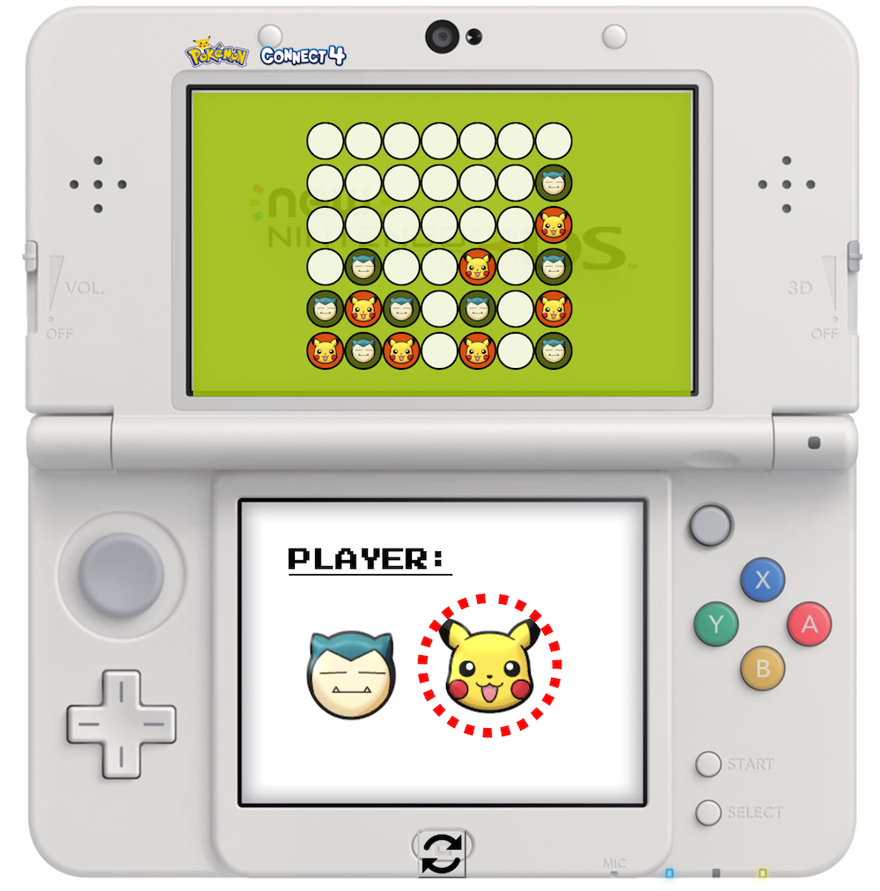

## Barrett's Connect Four Readme

## Introduction
This is my very first website and readme, any feedback or comments would 
greatly appreciated! Please leave a comment on my github @yeahbq or 
shoot me an email at 21barrett@gmail.com.

## Getting Started

**Pokemon Connect Four** is a multiplayer board game using a 7 x 6
grid. Two players can take turns playing by tapping on the respective
column that they would like their piece to drop down to.

### Rules
As stated from the creators of Connect Four, 
>To win Connect Four you must be the first player to get four of your 
>colored checkers in a row either horizontally, vertically or diagonally.

## Technologies Used
* Website created using HTML5
* Styled with CSS3 
* Game engine created in JavaScript
* Debugged using Chrome developer tools
* All text was created and written in Sublime
* Version tracked using git in terminal
* Versions updated and kept online from GitHub

## Development Notes

### 1. MVP
* Dynamically create a 7 x 6 board
* Playable by two players taking turns
* Create winning and losing conditions
* To be deployed and played online

### 2. Completed
* Completed MVP
* Added ability to check for ties and improved win logic
* Added new game (refresh button)
* Added Pokemon styling
* Added nintendo 3ds themeing

### 3. Icebox
* A counter for wins and losses
* Custom game animations and sounds
* Single player AI to play against

**_Last updated on 12/18/16_**
